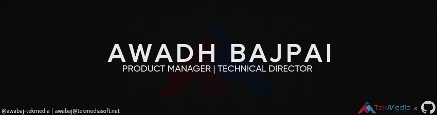

# 💻 Awadh Bajpai's Professional Space!  

Hello! I'm **Awadh Bajpai**, a seasoned **Product Manager** with 20+ years of expertise in building innovative media transport solutions, cloud migration strategies, and IoT products. I’m passionate about simplifying complex challenges into impactful, user-focused products.  

---

## 💼 **Professional Experience**

### **TekMedia Software**  
**Product Manager** (Current)  
Driving program management and business strategies for media transport solutions, with a focus on cloud-native and virtualization technologies.  

**Key Skills**: Product Management, Cloud Migration, Media Transport, Business Strategy  

---

### **Net Insight**  
**Product Manager, Product Owner, System Architect** 
- Spearheaded the transition of hardware appliances to cloud platforms.  
- Delivered **MEF-certified** Ethernet transport products and managed outsourcing projects.  
- Designed MVPs, evaluated emerging technologies, and supported CTO-led innovation.  

**Key Skills**: Cloud-Native Solutions, Ethernet Transport, MEF Compliance, Agile Methodologies  

---

### **IP Infusion EMEA**  
**Field Application Engineer**
Provided pre-sales and post-sales engineering for IP-based solutions, including product demos, roadmap consulting, and lifecycle support.  

**Key Skills**: IP Networking, Customer Engagement, Pre-Sales Engineering  

---

### **Ericsson Sweden**  
**Design Engineer**
Developed Linux drivers for clock synchronization and traffic classification, contributing to next-gen router platforms.  

**Key Skills**: Linux Systems, Device Drivers, Networking  

---

### **Aricent**  
**Technical Lead Development**
Engineered Ethernet CFM solutions and led automation projects for Broadcom-based platforms.  

**Key Skills**: Ethernet CFM, Automation, Broadcom Platforms  

---

### **Orckit-Corrigent, Israel**  
**Real-Time Software Engineer**
Delivered innovative RPR-over-Ethernet solutions and supported knowledge transfers for software teams.  

**Key Skills**: Real-Time Systems, Ethernet Protocols, Software Integration  

---

### **Flextronics Software Systems**  
**Senior Software Engineer**
Designed and integrated RAR and CCAC solutions for advanced IP-based systems.  

**Key Skills**: IP Systems, Software Design, Integration  

---

### **Future Software Ltd.**  
**Software Engineer**
Developed network monitoring solutions with a focus on VOIP protocols and core router testing.  

**Key Skills**: VOIP Protocols, OSPF & ISIS, Network Monitoring  

---

## 💻 **Tech Skills**  

### **Domains**  
- 🌐 **Media Transport Solutions**  
- ☁️ **Cloud Virtualization**  
- 📡 **IoT and Telecom**  

### **Technical Expertise**  
- **Programming**: Linux, IP Networking, Device Drivers  
- **Networking Protocols**: RIST, SRT, RTP, Ethernet (MEF-certified)  
- **Software Development**: Agile, MVP Design, Technical Sales  
- **Cloud Platforms**: Virtualization and Cloud Migration  

---

## 🏆 **Achievements**  
- Successfully transitioned hardware appliances to **cloud-based solutions**.  
- Led cross-functional teams for **timely software delivery** and product integration.  
- Delivered **MEF-certified** Ethernet transport products.  
- Built customer-focused solutions through hands-on involvement in **traditional and agile methods**.  

---

## 🚀 **Let’s Connect!**  
📫 Feel free to reach out for opportunities or collaborations:  
- **[LinkedIn](https://www.linkedin.com/in/awadhbajpai/)**  
- **[Email](mailto:awabaj@tekmediasoft.net)**  

---
